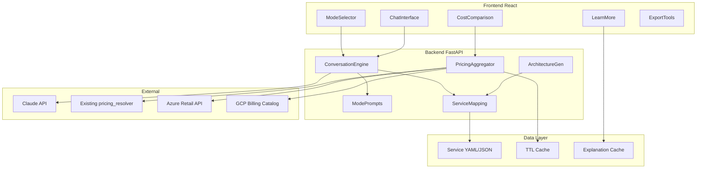

# AI-Driven Multi-Cloud Calculator — Implementation Plan

**Version:** 1.0  
**Purpose:** Evolve the existing awspricing repo (AWS Backup vs S3 calculator) into the AI-Driven Multi-Cloud Service Calculator by adding a conversation engine, three-mode UX, service mapping, and multi-cloud pricing while reusing existing pricing/cache/cost-engine patterns.

---

## Current State vs Target

### Existing awspricing (today)

- **Backend:** FastAPI on port 8000. Endpoints: `/api/pricing/aws-backup`, `/api/pricing/s3-storage`, `/api/calc`, `/api/regions`, `/health`. In-memory TTL cache, `pricing_resolver.py` (public list + GetProducts), `cost_engine.py`. No AI, no multi-cloud, no conversation.
- **Frontend:** React + Vite + TypeScript. Inputs panel, preset table, comparison table, transparency footer, export (copy/CSV). No mode selector, no chat, no learning UI.

### Target (from planning doc)

- **Backend:** Same FastAPI app extended with: conversation engine (Claude API), mode-aware prompts, service mapping (~20 services × 3 clouds), multi-cloud pricing aggregation (AWS, Azure, GCP), architecture generator. Optional Redis for pricing/explanation cache (plan allows keeping in-memory for MVP).
- **Frontend:** Mode selector (Expert/Balanced/Guided), chat interface, expandable “[Learn more]” / “[Compare clouds]”, cost comparison table, text-based architecture output, export (PDF, CSV).
- **Data:** Service equivalency DB (YAML/JSON), session state for conversation, cached explanations for common concepts.

---

## Tech Stack Summary

| Layer | Technology | Justification |
|-------|------------|---------------|
| Backend API | FastAPI + Python 3.12 | You already know it, rich AI ecosystem, async |
| AI/LLM | Anthropic Claude (Sonnet + Haiku) | Best for conversations, cost-efficient with caching |
| Frontend | React + TypeScript + Vite | You already know it, fast dev, huge ecosystem |
| UI Components | Tailwind CSS + shadcn/ui | Clean, customizable, accessible |
| State Management | Zustand | Simple, TypeScript-first, no boilerplate |
| Session Cache | Redis | Fast, TTL support, perfect for ephemeral data |
| Persistent DB | PostgreSQL (Phase 2) | JSONB for flexibility, relational for users |
| Diagrams | Mermaid.js (MVP) → React Flow (Phase 2) | AI-friendly text format, beautiful output |
| PDF Export | jsPDF + html2canvas | Client-side, no server overhead |
| Deployment | GCP Cloud Run (MVP) | Cheapest, scale-to-zero, container-based |
| Monitoring | Sentry + Cloud Logging | Errors + structured logs |
| Pricing APIs | AWS (boto3), Azure (REST), GCP (SDK) | Native clients, well-documented |

---

## Architecture (High-Level)

---

## Reuse from Existing Codebase

| Asset | Use in AI Calculator |
|-------|------------------------|
| `backend/app/pricing_resolver.py` | AWS pricing resolution; extend or call from new `pricing/aggregator.py` for AWS leg of multi-cloud. |
| `backend/app/region_mapping.py` | Region codes → location strings for AWS; replicate pattern for Azure/GCP. |
| `backend/app/cache.py` | Same TTL cache for pricing; add namespaces for “explanations” and multi-cloud keys. |
| `backend/app/cost_engine.py` | Patterns for tier/flat math; reuse for any server-side cost rollups. |
| `backend/app/main.py` | Add new router (e.g. `/api/conversation`, `/api/explain`, `/api/compare`) alongside existing routes; keep existing `/api/pricing/*`, `/api/calc`, `/api/regions` for backward compatibility or legacy calculator. |
| `frontend/src/api/client.ts` | Add conversation, explain, and compare endpoints; keep existing pricing/regions. |
| Frontend components | `ComparisonTable.tsx` and export patterns (copy/CSV) can be adapted for multi-cloud comparison and PDF export. |

---

## Recommended “What to Tackle First”

The planning doc offers A) System prompts, B) Service mapping, C) Frontend specs, D) Backend API. Recommended order:

1. **D) Backend API architecture** — Define FastAPI routes, request/response models, and where conversation vs pricing vs explain sit. This gives a clear contract for prompts and frontend.
2. **A) System prompts** — Once routes exist, implement Expert/Balanced/Guided prompts and wire them into the conversation engine (Claude).
3. **B) Service mapping** — Schema and ~20 core services per cloud (YAML/JSON) so the recommender and pricing aggregator have a single source of truth.
4. **C) Frontend component specs** — Mode selector, chat, learn-more, cost comparison, export; then implement.

So: **D → A → B → C** (with B and A partly parallel after D is sketched).

---

## Implementation Phases (Mapped to Repo)

### Phase 1: Foundation (Weeks 1–4)

- **Backend structure**
  - Add `app/conversation/` (e.g. `engine.py`, `prompts.py`, `state.py`).
  - Add `app/services/` (e.g. `mapping.py`, `recommender.py`, `architecture.py`).
  - Add `app/pricing/` with `aggregator.py`; keep existing `pricing_resolver.py` as AWS implementation used by aggregator.
  - In `main.py`: mount new routers (e.g. `POST /api/conversation`, `GET/POST /api/session`, `GET /api/explain/:key`, `POST /api/compare`). Keep existing `/api/pricing/*`, `/api/calc`, `/api/regions`, `/health`.
- **Mode selection**
  - Request model: `mode: "expert" | "balanced" | "guided"` (e.g. in session or per request). Store in conversation state.
- **Conversation engine (basic)**
  - Integrate Claude API (add `anthropic` to `requirements.txt`).
  - Single endpoint: accept user message + session id + mode; return AI reply; optional structured slots for “recommended services” and “architecture summary” for later use.
- **Service mapping**
  - Directory `data/services/` (or `backend/data/services/`) with YAML/JSON for ~20 core services per cloud (AWS, Azure, GCP). Schema: service id, name, cloud, category (compute, storage, db, etc.), optional equivalency group.
  - Load in `app/services/mapping.py` and expose “list by scenario” or “by id” for the recommender.
- **AWS pricing reuse**
  - From `pricing/aggregator.py`, call existing `resolve_s3_storage`, `resolve_aws_backup_storage` and any other resolvers you add (e.g. EC2, RDS) so the AI calculator can show live AWS costs for recommended services.

**Deliverables:** Backend routes for conversation and session; mode in session; Claude integrated; service mapping schema + data; aggregator calling existing AWS pricing.

---

### Phase 2: Core Features (Weeks 5–8)

- **Requirements extraction**
  - In prompts (A): dialogue that asks for scenario (e.g. web app, data pipeline, API backend, static site, DB-driven app), scale, region preferences. Output structured “requirements” object (e.g. scenario, region, optional constraints).
- **Service recommendation**
  - `services/recommender.py`: map requirements → list of service ids (from mapping) per cloud; use Claude with few-shot or structured output, or rule-based from scenario → preset service lists for MVP.
- **Multi-cloud pricing**
  - Implement Azure and GCP pricing modules (e.g. `pricing/azure.py`, `pricing/gcp.py`) and aggregate in `pricing/aggregator.py` (same region concept, normalized to USD/month where possible).
  - Cache per cloud/region/service in existing cache (extend key scheme in `cache.py`).
- **Cost calculations**
  - Use existing cost_engine patterns for server-side rollups (e.g. compute + storage + DB) and return in conversation response or dedicated `/api/compare` response.
- **Text-based architecture**
  - `services/architecture.py`: from recommended service ids, generate short text summary (component list + roles). Optionally structured (e.g. JSON) for future diagram step.

**Deliverables:** End-to-end flow: user describes need → requirements extracted → services recommended per cloud → live pricing aggregated → text architecture + cost comparison returned.

---

### Phase 3: UI/UX (Weeks 9–12)

- **React frontend**
  - New entry flow: landing with **mode selector** (Expert / Balanced / Guided); store mode in session/context.
  - **Chat interface:** message list, input, send; call `POST /api/conversation` (or stream if added later). Display AI reply with optional structured blocks (architecture, comparison table).
  - **Expandable learning:** “[Learn more]” / “[Why this choice?]” / “[Compare clouds]” that call `GET /api/explain/:key` or `POST /api/compare` and show in modal or inline expand.
  - **Cost comparison table:** reuse/extend `ComparisonTable.tsx` for multi-cloud (columns: AWS, Azure, GCP; rows: service or total).
  - **Export:** CSV (extend current pattern); add PDF (e.g. jsPDF or backend-generated PDF).
- **State**
  - Conversation state: session id, mode, message history, last recommendation (for export). Use React state + backend session or persist session server-side.

**Deliverables:** Mode selector, chat UI, learn-more/compare actions, cost table, CSV/PDF export.

---

### Phase 4: Polish (Weeks 13–16)

- **Interactive architecture diagrams**
  - Optional: render text architecture as diagram (e.g. Mermaid or simple node/link component) in `ArchitectureDiagram.tsx`.
- **Token optimization**
  - Cached explanations for common terms (e.g. “Multi-AZ”, “Fargate”); cache key by term + mode; 90% hit target for FAQ-style requests.
  - Batch “explain” requests if multiple terms requested in one action.
- **Error handling and testing**
  - Graceful degradation when a cloud API fails (show partial comparison). Tests for conversation engine, mapping, aggregator.
- **Documentation**
  - Update `docs/README.md` (or add `docs/PLANNING.md`) with AI calculator flows, mode behavior, and API summary.

---

## Suggested First Implementation Steps (Concrete)

1. **Backend API (D)**
   - Add `POST /api/conversation` body: `{ "session_id": "...", "message": "...", "mode": "expert"|"balanced"|"guided" }`. Response: `{ "reply": "...", "session_id": "...", "recommendation": null }` (recommendation optional for later).
   - Add in-memory or Redis-backed session store (session_id → message history + mode).
   - In `main.py`, include new router and keep existing routes.
2. **System prompts (A)**
   - In `app/conversation/prompts.py`, define three prompt templates (Expert, Balanced, Guided) with different verbosity and instruction sets; pass selected prompt into Claude in `engine.py`.
3. **Service mapping (B)**
   - Create `data/services/` and one YAML file per cloud (e.g. `aws_services.yaml`) with ~20 entries: id, name, category, typical scenario. Implement `mapping.py` to load and query by scenario or id.
4. **Frontend specs (C)**
   - Document in a short spec (or in PLANNING.md): ModeSelector props/states, ChatInterface message shape, LearnMore trigger and API, CostComparison columns/rows, Export payload. Then implement ModeSelector and a minimal ChatInterface that calls the new backend.

---

## Port and Deployment Notes

- Current: backend **8000**, frontend **3001→80** (docker-compose). Locked-ports rule uses **80** (UI) and **8003** (API). For this project you can either keep 8000/3001 or align to **8003** for the API and **80** for the UI in docker-compose so it matches the rest of your environment.
- Add **ksh, apt-get upgrade, wget, curl, vim** to backend Dockerfile if you want them as per your standard container rules.

---

## Summary

This plan keeps the existing Backup vs S3 calculator intact while adding the AI-driven multi-cloud calculator as the primary experience; you can later hide or move the legacy flow to a sub-route or separate app if desired.

**Related docs:** [docs/README.md](README.md) (awspricing overview) | [AWS S3 and Backup Pricing](AWS-S3-AND-BACKUP-PRICING.md) | [Pricing Sources](PRICING-SOURCES.md)
